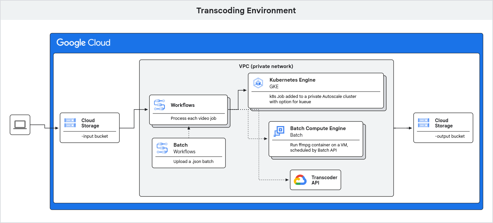

# GKE GitHub Actions Deployment
This repository is a full example of a CI/CD pipeline using GitHub actions,
terraform and other tech to create and deploy workloads to a GKE Autopilot
installation.

It includes working examples of: 
  - Terraform scripts for Google Cloud provisioning
  - GitHub actions for Google Cloud CI/CD pipelines
  - Building an ffmpeg container using Cloud Build
  - Using Kueue for Kubernetes Job management 
  - Google Cloud Workflows
  - GCSFuse for storage

## Architecture


## Technology Used 
- [Terraform](https://www.terraform.io/downloads.html)
- [Artifact Registry](https://cloud.google.com/artifact-registry/docs)
- [GitHub Actions](https://docs.github.com/en/actions)
- [GKE Autopilot](https://cloud.google.com/kubernetes-engine/docs/concepts/autopilot-overview)
- [Kueue](https://kueue.sigs.k8s.io/docs/overview/)
- [Skaffold](https://skaffold.dev/docs/)
- [kubectl](https://kubernetes.io/docs/tasks/tools/install-kubectl/)
- [gcloud](https://cloud.google.com/sdk/docs/install)
- Future TBD:
  - Helm charts
  - ArgoCD

## Workload
We will be deploying a container image of a customized 'ffmpeg' build to a GKE Autopilot Kubernetes cluster.

> __Note:__ Due to the need for potentially 15k+ nodes, configuration and deployment of multiple Autopilot clusters must be supported.

Instructions for building container images can be [found here](./containers/README.md).

## Initializing up your Project

1. First authenticate to Google Cloud:

  ```bash
  gcloud auth application-default login
  ```

2. Create a new project (skip this if you already have a project created):

  ```bash
  gcloud projects create <your-project-id>
  ```

3. Set the new project as your context for the `gcloud` CLI:

  ```bash
  gcloud config set project <your-project-id>
  ```

4. Check if your authentication is ok and your project id is set:

  ```bash
  gcloud projects describe <your-project-id>
  ```

> __Note:__ You should see your `projectId` listed with an `ACTIVE` state.

5. Enable all the needed Google Cloud APIs by running this script:

  ```bash
  sh ./scripts/enable-api.sh
  ```

## Provisioning Infrastructure

There are 2 options for deployment:

1. Run the `terraform` CLI on the command line directly. [See instructions here.](./terraform/README.md)

2. Use a GitHub Action to run all the Terraform configuration files. [See instructions here.](./github-actions/README.md)

## Setting up GKE

Instructions for setting up GKE can be [found here](./gke/README.md)

## Setting up GitHub Actions

Instructions for setting up and using GitHub Actions can be [found here](./github-actions/README.md)

## Building Container Images

Instructions for building container images can be [found here](./containers/README.md).

## Kueue

Kueue is a Kubernetes-native system that manages job quotas by determining when jobs should wait, start, or be preempted.

Instructions for setting up Kueue in your environment can be [found here](./examples/kueue/README.md).

## Batch Compute Jobs
For one-time or routine batch processing, the [Compute Engine Batch](https://cloud.google.com/batch/docs/create-run-job) service can be used to define a job template, setup quota, schedule 1-N jobs, clean up, and monitor/troubleshoot jobs as they run.

Instructions for setting up Batch Compute Jobs in your environment can be [found here](./examples/batch-compute-jobs/README.md).