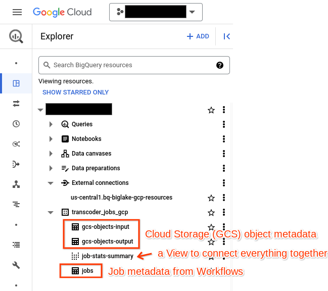

# Analytics of Jobs using BigQuery

> TODO(alanpoole): diagram

# Tables


## Jobs Stats Summary
The `Jobs Stats Summary` View connects the Jobs, GCS `-input` objects, `-output` objects, and other log metadata into a single view to connect all the dots.

```
SELECT
  `BackendSrv`,
  `JobId`,
  `createdDateTime`,
  `input_file_content_size`,
  `input_file_content_type`,
  `input_file_generation`,
  `input_file_uri`,
  `output_files`.`URI`,
  `output_files`.`content_type`,
  `output_files`.`generation`
FROM
  `transcoder_jobs_gcp.job-stats-summary`
```

## Jobs
In [BigQuery](https://console.cloud.google.com/bigquery), the `Jobs` table provides a list of each Transcoding Job uploaded to GCS or initiated by the Workflow. You'll find the [schema here](../analytics/bq-job-stats-schema.json). This is automatically deployed by [terraform](../terraform/bq.tf) and populated by [upload-event](../workflows/upload-event-workflow.yaml) workflow.

## Google Cloud Storage (GCS) Objects

These BigQuery [Object tables](https://cloud.google.com/bigquery/docs/object-table-introduction) are created automatically by [terraform](../terraform/bq.tf) and are connected using the `bq-biglake-gcp-resources` external connection.

 * `gcs-objects-input` is all objects in the `-input` GCS bucket
 * `gcs-objects-output` is all the objects in the `-output` GCS bucket

## Logs Sinks

Several Log Sinks have been automatically established from Batch Jobs (Compute), Workflow, Kubernetes Engine Events and more. These are defined in the [terraform](../terraform/logs.tf).

* `events`
* `cloudaudit_googleapis_com_activity`
* `batch`