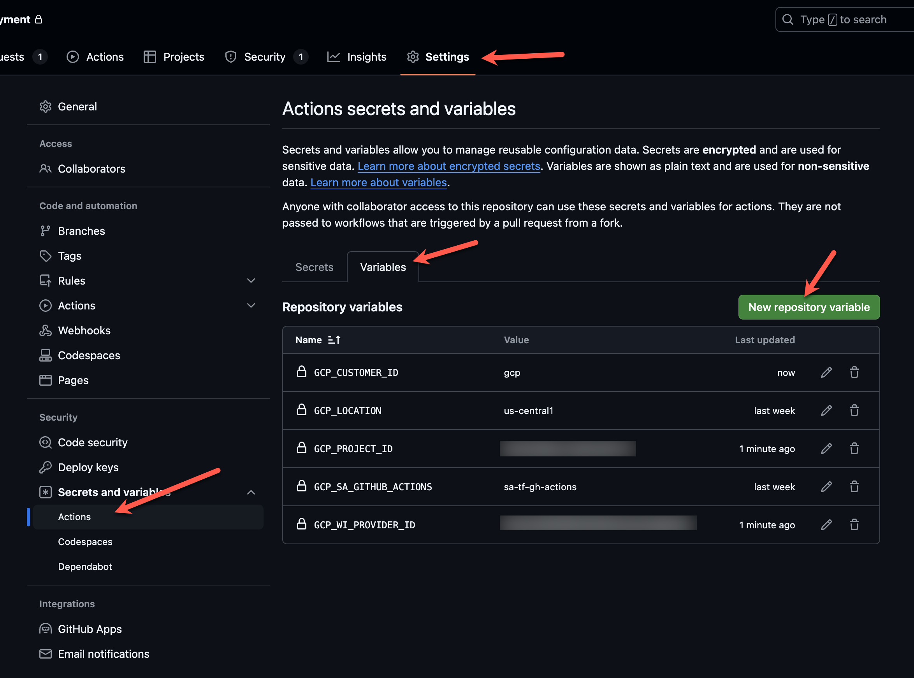
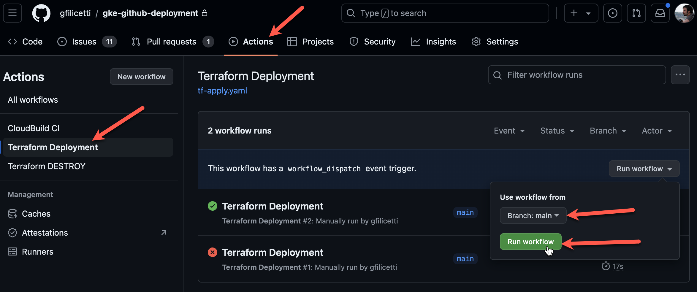

# Github Actions
This project has a number of examples of using Github Actions with Google Cloud, namely:

- Provisioning infrastructure with Terraform
- Tearing down infrastructure with Terraform
- Invoking Cloud Build to build our container for ffmpeg

## Setting up GitHub Actions for Google Cloud
To setup GitHub Actions securely with our Google Cloud environment we will need to do a one time setup for Workload Identity federation through a Google Cloud service account. [More info here.](https://github.com/google-github-actions/auth?tab=readme-ov-file#workload-identity-federation-through-a-service-account)

### Create a Fork

Setting up GitHub Actions for automated deployments with Terraform requires the Google Cloud administrator to create a fork of this repository, to personalize variable settings for your unique cloud environment.

1. Create a fork of this repository on the GitHub site. [Instructions here](https://docs.github.com/en/pull-requests/collaborating-with-pull-requests/working-with-forks/fork-a-repo).

2. Clone your new fork:

    ```bash
    git clone https://github.com/<your-github-username>/gke-github-deployment.git
    ```

This will create a new Service Account and give it all necessary roles.

### Enable Workload Identity Federation

Run this script:

```bash
bash ./scripts/enable-gh-actions.sh
```

Make note of the returned output from running this script. It will look like this:

```
----- GITHUB ACTIONS ENV KEY/VALUE -----

GCP_SA_GITHUB_ACTIONS: sa-tf-gh-actions
GCP_PROJECT_ID: <your-project-id>
GCP_WI_PROVIDER_ID: <workload-id-provider-id>
GCP_CUSTOMER_ID: <your-customer-id>
GCP_LOCATION: <gcp-region>

----------------------------------------
```

You will need these values to finish setting up GitHub Actions.

> __Note:__ If using the GitHub CLI (`gh`) these values will be populated for you in declared repo.

### Enable IAM and Google Cloud Service Accounts to deploy resources to Cloud from GitHub Actions

Run this script:

```bash
bash ./scripts/enable-iam.sh
```

### Setup GitHub Actions In Your Fork

With the 2 key/value pairs outputted from the script in the previous step, follow these steps:

1. In the Settings tab on the GitHub page for your fork, go to: **Secrets and Variables > Actions**
1. Click on the **Variables** tab
1. Click the **New repository variable** green button
1. Enter in your key value pairs

You should see two entries that look like this:



## Provisioning Infrastructure with Terraform

0. (One time only) Create remote state for Terraform in Google Cloud Storage:

  ```bash
  bash ./scripts/setup-tfstate.sh
  ```

1. Follow these steps to invoke the GitHub Action that will run terraform to provision our infrastructure.
    1. Navigate to the **Actions** tab in GitHub
    1. On the left side, click **Terraform Deployment**
    1. On the right side, click the **Run workflow** button
    1. In the drop down you get, select the **main** branch
    1. Click on the **Run workflow** green button



## Tearing Down Infrastructure with Terraform

Using the method above, run the: **Terraform DESTROY** GitHub action.

## Invoking Cloud Build

You can use the **CloudBuild CI** GitHub action to build and push containers to Artifact Registry, where they will later be used to deploy to a container runtime environment like GKE.

For more information on containers in this project, see their [README file](../containers/ffmpeg/README.md).
