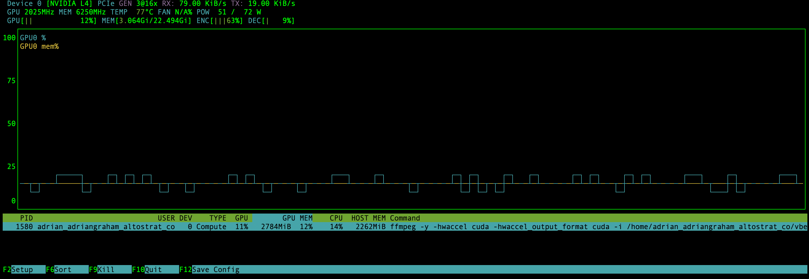
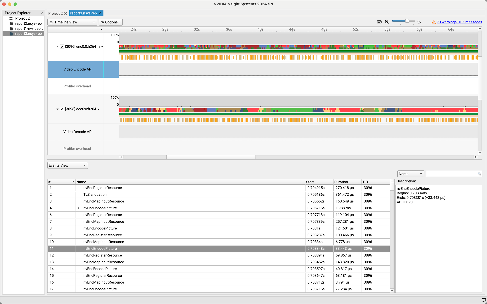

# Monitoring GPU encoder usage

There are a number of ways to determine the efficiency of GPU-accelerated tasks executed by `ffmpeg`, from simple, command line utilities to complex performance profilers.

## nvidia-smi

`nvidia-smi` is a built-in command that's installed when NVIDIA drivers are installed. Use the following flags to monitor encoder/decoder usage:

```bash
nvidia-smi dmon -s pucvmet
```
The output looks like:


Note the `enc` and `dec` columns show NVENC and NVDEC usage, respectively.

## nvtop and nvitop

[`nvtop`](https://github.com/Syllo/nvtop) and [`nvitop`](https://pypi.org/project/nvitop/) are open source command-line utilities for monitoring both CPU and GPU stats.

`nvtop` output:



## gpustat

[`gpustat`](https://github.com/wookayin/gpustat) is a simple, open source command-line utility for monitoring GPU stats.

To watch encoder and decoder usage, use the following command:

```bash
gpustat -e -i
```

The output looks like:


Note the `E` and `D` fields show NVENC and NVDEC usage, respectively.

## DCGM

[NVIDIA Data Center GPU Manager](https://docs.nvidia.com/nsight-systems/InstallationGuide/index.html) (DCGM) is a suite of tools for managing and monitoring NVIDIA datacenter GPUs in cluster environments. You can install DCGM tools on a worker node for deeper insight into GPU utilization.

```bash
# Get a list of DCGM metrics
dcgmi dmon -l | grep enc_stats

# Note the Field ID (integer) and use it to track utilization
dcgmi dmon -e 206 # track encoder utilization
dcgmi dmon -e 207 # track decoder utilization
```

The output looks like:

 

## nSight

[NVIDIA nSight](https://docs.nvidia.com/nsight-systems/InstallationGuide/index.html) is the one of the most advanced GPU profiling tools available. You can [install the agent](https://docs.nvidia.com/nsight-systems/InstallationGuide/index.html#optional-setting-up-the-cli) on the remote host to record profiling data, then view the data using a local client.

Once installed, you can capture profiling data by wrapping your ffmpeg script with the following command:

```bash
nsys profile --trace nvvideo [SCRIPT]
```

The resulting data will be written in `.nsys-rep` format. You can then download the output and view it on a local client:



# Further reading
- [Introduction to HW acceleration in FFMpeg](https://trac.ffmpeg.org/wiki/HWAccelIntro)
- [vbench: Benchmarking Video Transcoding in the Cloud](https://dl.acm.org/doi/pdf/10.1145/3296957.3173207)
- [Monitoring GPU performance on Linux VMs](https://cloud.google.com/compute/docs/gpus/monitor-gpus)
- [Installing the Ops Agent on individual VMs](https://cloud.google.com/stackdriver/docs/solutions/agents/ops-agent/installation)
- [Ops Agent DCGM metrics](https://cloud.google.com/monitoring/api/metrics_opsagent#opsagent-dcgm)